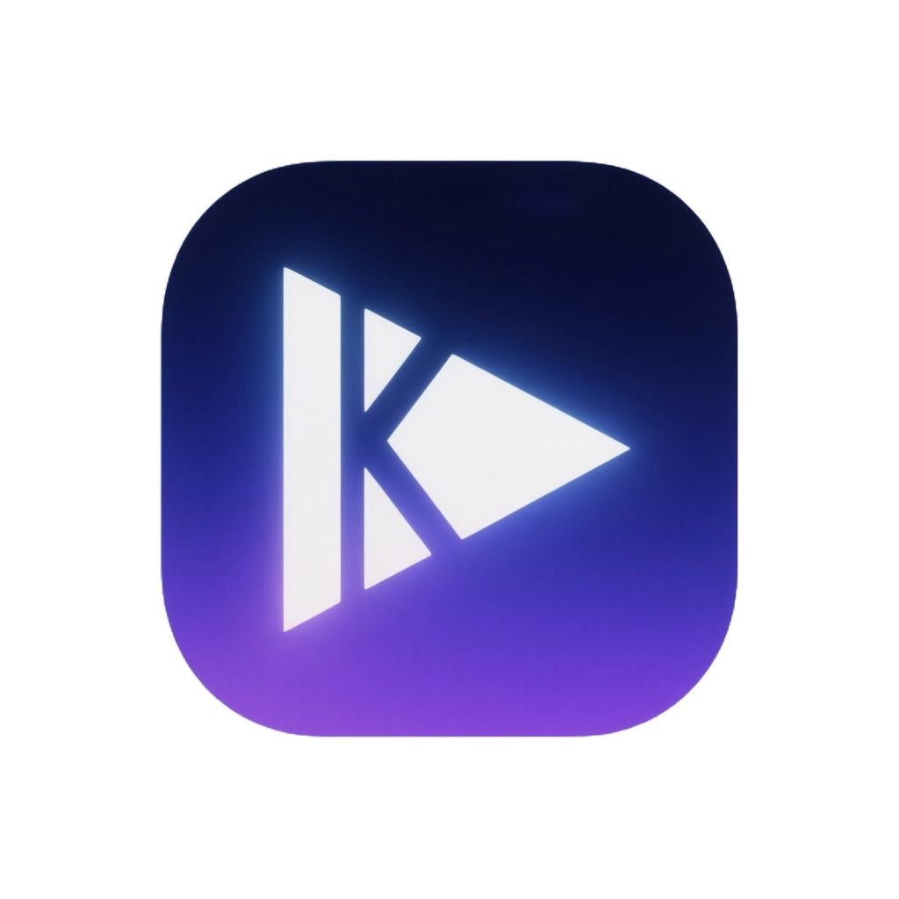

[](https://github.com/luxingzhen/KVideo-pro/actions/workflows/Github_Upstream_Sync.yml)

# 视频聚合平台 (KVideo)



> 一个基于 Next.js 16 构建的现代化视频聚合播放平台。采用独特的 "Liquid Glass" 设计语言，提供流畅的视觉体验和强大的视频搜索功能。

**🌐 在线体验：[[https://jisuysc.com/]](https://kvideo.pages.dev/)**

[](https://nextjs.org/)
[](https://react.dev/)
[](https://tailwindcss.com/)
[](https://www.typescriptlang.org/)
[](LICENSE)

## 📖 项目简介

**KKVideo-pro** 是一个高性能、现代化的视频聚合与播放应用，根据https://github.com/KuekHaoYang/KVideo 二次开发的来.专门添加了广告为自己赚点零花钱。

### 核心设计理念：Liquid Glass（液态玻璃）

项目的视觉设计基于 **"Liquid Glass"** 设计系统，这是一套融合了以下特性的现代化 UI 设计语言：

- **玻璃拟态效果**：通过 `backdrop-filter` 实现的磨砂半透明效果，让 UI 元素如同真实的玻璃材质
- **通用柔和度**：统一使用 `rounded-2xl` 和 `rounded-full` 两种圆角半径，创造和谐的视觉体验
- **光影交互**：悬停和聚焦状态下的内发光效果，模拟光线被"捕获"的物理现象
- **流畅动画**：基于物理的 `cubic-bezier` 曲线，实现自然的加速和减速过渡
- **深度层级**：清晰的 z-axis 层次结构，增强空间感和交互反馈

## ✨ 核心功能

### 🎥 智能视频播放

- **HLS 流媒体支持**：原生支持 HLS (.m3u8) 格式，提供流畅的视频播放体验
- **智能缓存机制**：Service Worker 驱动的智能缓存系统，自动预加载和缓存视频片段
- **后台下载**：利用观看历史，在后台自动下载历史视频，确保离线也能观看
- **播放控制**：完整的播放控制功能，包括进度条、音量控制、播放速度调节、全屏模式等
- **移动端优化**：专门为移动设备优化的播放器界面和手势控制

### 🔍 多源并行搜索

- **聚合搜索引擎**：同时在多个视频源中并行搜索，大幅提升搜索速度
- **自定义视频源**：支持添加、编辑和管理自定义视频源
- **智能解析**：统一的解析器系统，自动处理不同源的数据格式
- **搜索历史**：自动保存搜索历史，支持快速重新搜索
- **结果排序**：支持按评分、时间、相关性等多种方式排序搜索结果

### 🎬 豆瓣集成

- **电影 & 电视剧分类**：支持在电影和电视剧之间无缝切换，方便查找不同类型的影视资源
- **详细影视信息**：自动获取豆瓣评分、演员阵容、剧情简介等详细信息
- **推荐系统**：基于豆瓣数据的相关推荐
- **专业评价**：展示豆瓣用户评价和专业影评

### 💾 观看历史管理

- **自动记录**：自动记录观看进度和历史
- **断点续播**：从上次观看位置继续播放
- **历史管理**：支持删除单条历史或清空全部历史
- **隐私保护**：所有数据存储在本地，不上传到服务器

### 📱 响应式设计

- **全端适配**：完美支持桌面、平板和移动设备
- **移动优先**：专门的移动端组件和交互设计
- **触摸优化**：针对触摸屏优化的手势和交互

### 🌙 主题系统

- **深色/浅色模式**：支持系统级主题切换
- **动态主题**：基于 CSS Variables 的动态主题系统
- **无缝过渡**：主题切换时的平滑过渡动画

### ⌨️ 无障碍设计

- **键盘导航**：完整的键盘快捷键支持
- **ARIA 标签**：符合 WCAG 2.2 标准的无障碍实现
- **语义化 HTML**：使用语义化标签提升可访问性
- **高对比度**：确保 4.5:1 的文字对比度

### 💎 高级模式

- **独立入口**：在浏览器地址栏直接输入 `/premium` 即可进入独立的高级视频专区
- **内容隔离**：高级内容与普通内容完全物理隔离，互不干扰
- **专属设置**：拥有独立的内容源管理和功能设置

### 🛡️ 广告过滤

- **多模式选择**：支持关闭、关键词过滤、智能启发式过滤(Beta)和激进模式。
- **UI 集成**：在播放器设置菜单中直接切换模式，实时生效。
- **自定义关键词**：支持通过环境变量扩展过滤关键词。
- **高性能**：基于流式处理，对播放加载速度几乎无影响。

## 🔐 隐私保护

本应用注重用户隐私：

- **本地存储**：所有数据存储在本地浏览器中
- **无服务器数据**：不收集或上传任何用户数据
- **自定义源**：用户可自行配置视频源

## 💰 广告变现管理 (New)

KVideo 内置了简单易用的广告管理系统，帮助站长快速实现流量变现。

### 1. 广告位介绍

KVideo 提供全方位的广告展示能力，支持桌面端和移动端的差异化展示：

- **播放器暂停广告 (Overlay)**：用户暂停视频时，在播放器中央显示的弹窗广告。
- **播放器上方横幅 (Player Top)**：在播放器正上方显示的横幅广告（桌面端建议 728x90）。
- **详情页侧边栏 (Banner)**：在视频详情页右侧显示的横幅广告（建议 300x250）。
- **[NEW] 移动端底部悬浮 (Mobile Sticky)**：仅在手机端显示，固定在底部的悬浮广告（复用 Banner 内容）。
- **[NEW] 列表流广告 (Feed)**：在视频列表（首页/搜索）中每隔 6 个视频自动插入一个广告（仅移动端，复用 Banner 内容）。

> **💡 智能隐藏**：未配置广告代码的区域会自动折叠隐藏，不会显示空白占位符。

### 2. 设置广告代码 (推荐方式)

KVideo 支持两种广告配置方式，适用于不同的部署场景。

#### 方式 A：使用 Cloudflare 环境变量 (推荐)

适用于 Cloudflare Pages 部署。这种方式最安全， 也最符合 Cloudflare 的最佳实践。

1. 进入 Cloudflare 项目设置 -> Environment variables。
2. 添加以下变量：
   - `NEXT_PUBLIC_AD_OVERLAY`: (暂停广告 HTML 代码)
   - `NEXT_PUBLIC_AD_BANNER`: (侧边栏/移动端底部/列表流 广告 HTML 代码)
   - `NEXT_PUBLIC_AD_PLAYER_TOP`: (播放器上方广告 HTML 代码)
   - `ADMIN_PASSWORD`: (后台管理页面登录密码)
3. 重新部署项目即可生效。

#### 方式 B：使用内置管理后台 (代码生成器)

如果您不熟悉如何编写广告代码，可以使用我们提供的辅助工具：

- **访问地址**：`/admin` (例如 `https://your-site.com/admin`)
- **功能**：这是一个纯客户端的辅助工具，用于生成和预览广告代码。
- **操作流程**：在页面中粘贴广告代码 -> 点击"复制" -> 将复制的内容填入 Cloudflare 环境变量。

> **注意**：由于 Cloudflare 是无服务器环境，后台页面无法直接保存修改到服务器。它仅作为配置辅助工具存在。如果您不需要此辅助页面，可以直接忽略。

### 3. 配置持久化

如果您使用 Docker 部署，建议挂载配置目录以防止重启后广告配置丢失：

```bash
docker run -d -p 3000:3000 \
  -v $(pwd)/config:/app/config \
  -e ACCESS_PASSWORD=your_password \
  --name kvideo kvideo
```

## 🎨 站点名称自定义配置

通过环境变量可以自定义站点名称、标题和描述，无需修改源代码。

### 可用环境变量：

| 变量名                            | 说明       | 默认值                                |
| ------------------------------ | -------- | ---------------------------------- |
| `NEXT_PUBLIC_SITE_TITLE`       | 浏览器标签页标题 | `视频聚合平台 - KVideo`                  |
| `NEXT_PUBLIC_SITE_DESCRIPTION` | 站点描述     | `专属视频聚合播放平台，具备美观的 Liquid Glass UI` |
| `NEXT_PUBLIC_SITE_NAME`        | 站点头部名称   | `视频聚合平台`                           |
| `PERSIST_PASSWORD`             | 密码持久化    | `true`                             |

### 配置示例：

**Vercel 部署：**
在 Vercel 项目设置中添加环境变量：

- 变量名：`NEXT_PUBLIC_SITE_NAME`
- 变量值：`我的视频平台`

**Cloudflare Pages 部署：**
在 Cloudflare Pages 项目设置中添加环境变量：

- 变量名：`NEXT_PUBLIC_SITE_NAME`
- 变量值：`我的视频平台`

**Docker 部署：**

```bash
docker run -d -p 3000:3000 \
  -e NEXT_PUBLIC_SITE_NAME="我的视频平台" \
  -e NEXT_PUBLIC_SITE_TITLE="我的视频 - 聚合播放平台" \
  -e NEXT_PUBLIC_SITE_DESCRIPTION="专属视频聚合播放平台" \
  --name kvideo luxingzhen/kvideo:latest
```

**本地开发：**
在项目根目录创建 `.env.local` 文件：

```env
NEXT_PUBLIC_SITE_NAME=我的视频平台
NEXT_PUBLIC_SITE_TITLE=我的视频 - 聚合播放平台
NEXT_PUBLIC_SITE_DESCRIPTION=专属视频聚合播放平台
```

## 📦 自动订阅源配置

可以通过环境变量 `NEXT_PUBLIC_SUBSCRIPTION_SOURCES` 自动配置订阅源，应用启动时会自动加载并设置为自动更新。

**格式：** JSON 数组字符串，包含 `name` 和 `url` 字段。

**示例：**

```bash
NEXT_PUBLIC_SUBSCRIPTION_SOURCES='[{"name":"每日更新源","url":"https://example.com/api.json"},{"name":"备用源","url":"https://backup.com/api.json"}]'
```

**Docker 部署：**

```bash
docker run -d -p 3000:3000 -e NEXT_PUBLIC_SUBSCRIPTION_SOURCES='[{"name":"MySource","url":"..."}]' --name kvideo luxingzhen/kvideo:latest
```

**Vercel 部署：**

在 Vercel 项目设置中添加环境变量：

- 变量名：`NEXT_PUBLIC_SUBSCRIPTION_SOURCES`
- 变量值：`[{"name":"...","url":"..."}]`

**Cloudflare Pages 部署：**

在 Cloudflare Pages 项目设置中添加环境变量：

- 变量名：`NEXT_PUBLIC_SUBSCRIPTION_SOURCES`
- 变量值：`[{"name":"...","url":"..."}]`

## 📝 自定义源 JSON 格式

如果你想创建自己的订阅源或批量导入源，可以使用以下 JSON 格式。

**基本结构：**

可以是单个对象数组，也可以是包含 `sources` 或 `list` 字段的对象。

**源对象字段说明：**

| 字段         | 类型      | 必填  | 说明                                                     |
| ---------- | ------- | --- | ------------------------------------------------------ |
| `id`       | string  | 是   | 唯一标识符，建议使用英文                                           |
| `name`     | string  | 是   | 显示名称                                                   |
| `baseUrl`  | string  | 是   | API 地址 (例如: `https://example.com/api.php/provide/vod`) |
| `group`    | string  | 否   | 分组，可选值: `"normal"` (默认) 或 `"premium"`                  |
| `enabled`  | boolean | 否   | 是否启用，默认为 `true`                                        |
| `priority` | number  | 否   | 优先级，数字越小优先级越高，默认为 1                                    |

**示例 JSON：**

```json
[
  {
    "id": "my_source_1",
    "name": "我的精选源",
    "baseUrl": "https://api.example.com/vod",
    "group": "normal",
    "priority": 1
  },
  {
    "id": "premium_source_1",
    "name": "特殊资源",
    "baseUrl": "https://api.premium-source.com/vod",
    "group": "premium",
    "enabled": true
  }
]
```

### ⚠️ 重要的区别说明：订阅源 vs 视频源

**这是一个常见的误区，请仔细阅读：**

- **视频源 (Source)**：
  
  - 指向单个 CMS/App API 接口
  - 例如：`https://api.example.com/vod`
  - 这种链接**不能**直接作为"订阅"添加
  - 只能在"自定义源管理"中作为单个源添加

- **订阅源 (Subscription)**：
  
  - 指向一个 **JSON 文件**（如上面的示例）的 URL
  - 这个 JSON 文件里包含了一个或多个视频源的列表
  - 例如：`https://mysite.com/kvideo-sources.json`
  - 这是一个**配置文件**的链接，不是视频 API 的链接
  - 只有这种返回 JSON 列表的链接才能在"订阅管理"中添加

> **简单来说**：如果你只有一个 m3u8 或 API 接口地址，请去"自定义源"添加。如果你有一个包含多个源的 JSON 文件链接，请去"订阅管理"添加。

## 🛠 技术栈

### 前端核心

| 技术                                                | 版本     | 用途                     |
| ------------------------------------------------- | ------ | ---------------------- |
| **[Next.js](https://nextjs.org/)**                | 16.0.3 | React 框架，使用 App Router |
| **[React](https://react.dev/)**                   | 19.2.0 | UI 组件库                 |
| **[TypeScript](https://www.typescriptlang.org/)** | 5.x    | 类型安全的 JavaScript       |
| **[Tailwind CSS](https://tailwindcss.com/)**      | 4.x    | 实用优先的 CSS 框架           |
| **[Zustand](https://github.com/pmndrs/zustand)**  | 5.0.2  | 轻量级状态管理                |

### 开发工具

- **ESLint 9**：代码质量检查
- **PostCSS 8**：CSS 处理器
- **Vercel Analytics**：性能监控和分析

### 架构特点

- **App Router**：Next.js 13+ 的新路由系统，支持服务端组件和流式渲染
- **API Routes**：内置 API 端点，处理豆瓣数据和视频源代理
- **Service Worker**：离线缓存和智能预加载
- **Server Components**：优化首屏加载性能
- **Client Components**：复杂交互和状态管理

## 🚀 快速部署

### 在线体验

访问 **[https://jisuysc.com/](https://kvideo.vercel.app/)** 立即体验，无需安装！

### 部署到自己的服务器

#### 选项 1：Vercel 一键部署（推荐）

[](https://vercel.com/new/clone?repository-url=https://github.com/luxingzhen/KVideo-pro)

1. 点击上方按钮
2. 连接你的 GitHub 账号
3. Vercel 会自动检测 Next.js 项目并部署
4. 几分钟后即可访问你自己的 KVideo 实例

#### 选项 2：Cloudflare Pages 部署 (推荐)

此方法完全免费且速度极快，是部署本项目的最佳选择。

1. **Fork 本仓库**：首先将项目 Fork 到你的 GitHub 账户。

2. **创建项目**：
   
   - 点击访问 [**Cloudflare Pages - Connect Git**](https://dash.cloudflare.com/?to=/:account/pages/new/provider/github)。
   - 如果未连接 GitHub，请点击 **Connect GitHub**；若已连接，直接选择你刚刚 Fork 的 `KVideo` 项目并点击 **Begin setup**。

3. **配置构建参数**：
   
   - **Project name**: 默认为 `kvideo` (建议保持不变，后续链接基于此名称)
   - **Framework Preset**: 选择 `Next.js`
   - **Build command**: 输入 `npm run pages:build`
   - **Build output directory**: 输入 `.vercel/output/static`
   - 点击 **Save and Deploy**。

4. **⚠️ 关键步骤：修复运行时环境**
   
   > *注意：此时部署虽然显示"Success"，但你会发现访问网页会报错。这是因为缺少必要的兼容性配置。请按以下步骤修复：*
   
   - 进入 **[项目设置页面](https://dash.cloudflare.com/?to=/:account/pages/view/kvideo/settings/production)** (如果你的项目名不是 kvideo，请在控制台手动查找 Settings -> Functions)。
   - 拉到页面底部找到 **Compatibility flags** 部分。
   - 添加标志：`nodejs_compat`

5. **重试部署 (生效配置)**：
   
   - 回到 **[项目概览页面](https://dash.cloudflare.com/?to=/:account/pages/view/kvideo)**。
   - 在 **Deployments** 列表中，找到最新的那次部署。
   - 点击右侧的三个点 `...` 菜单，选择 **Retry deployment**。
   - 等待新的部署完成后，你的 KVideo 就部署成功了！

#### 选项 3：Docker 部署

**从 Docker Hub 拉取（最简单）：**

```bash
# 拉取最新版本
docker pull luxingzhen/kvideo:latest
docker run -d -p 3000:3000 --name kvideo luxingzhen/kvideo:latest
```

应用将在 `http://localhost:3000` 启动。

> **✨ 多架构支持**：镜像支持 2 种主流平台架构：
> 
> - `linux/amd64` - Intel/AMD 64位（大多数服务器、PC、Intel Mac）
> - `linux/arm64` - ARM 64位（Apple Silicon Mac、AWS Graviton、树莓派 4/5）

**自己构建镜像：**

```bash
git clone https://github.com/luxingzhen/KVideo-pro.git
cd KVideo
docker build -t kvideo .
docker run -d -p 3000:3000 --name kvideo kvideo
```

**使用 Docker Compose：**

```bash
docker-compose up -d
```

#### 选项 4：传统 Node.js 部署

```bash
# 1. 克隆仓库
git clone https://github.com/luxingzhen/KVideo-pro.git
cd KVideo

# 2. 安装依赖
npm install

# 3. 构建项目
npm run build

# 4. 启动生产服务器
npm start
```

应用将在 `http://localhost:3000` 启动。

## 🔄 如何更新

### Vercel 部署

Vercel 会自动检测 GitHub 仓库的更新并重新部署，无需手动操作。

### Docker 部署

当有新版本发布时：

```bash
# 停止并删除旧容器
docker stop kvideo
docker rm kvideo

# 拉取最新镜像
docker pull luxingzhen/kvideo:latest

# 运行新容器
docker run -d -p 3000:3000 --name kvideo luxingzhen/kvideo:latest
```

### Node.js 部署

```bash
cd KVideo
git pull origin main
npm install
npm run build
npm start
```

> **🔄 自动化部署**：本项目使用 GitHub Actions 自动构建和发布 Docker 镜像。每次代码推送到 main 分支时，会自动构建多架构镜像并推送到 Docker Hub。
>
> 镜像名称：`luxingzhen/kvideo`


## 🤝 贡献代码

我们非常欢迎各种形式的贡献！无论是报告 Bug、提出新功能建议、改进文档，还是提交代码，你的每一份贡献都让这个项目变得更好。

**想要参与开发？ 请查看 [贡献指南](CONTRIBUTING.md) 了解详细的开发规范和流程。**

快速开始：

1. **报告 Bug**：[提交 Issue](https://github.com/luxingzhen/KVideo-pro/issues)
2. **功能建议**：在 Issues 中提出你的想法
3. **代码贡献**：Fork → Branch → PR
4. **文档改进**：直接提交 PR

## 📄 许可证

本项目基于 [MIT 许可证](LICENSE) 开源。

## 🙏 致谢

感谢以下开源项目：

- [Next.js](https://nextjs.org/) - React 框架
- [Tailwind CSS](https://tailwindcss.com/) - CSS 框架
- [Zustand](https://github.com/pmndrs/zustand) - 状态管理
- [React](https://react.dev/) - UI 库

## 📞 联系方式

- **作者**：[luxingzhen](https://github.com/luxingzhen)
- **项目主页**：[https://github.com/luxingzhen/KVideo-pro](https://github.com/luxingzhen/KVideo-pro)
- **问题反馈**：[GitHub Issues](https://github.com/luxingzhen/KVideo-pro/issues)

---

<div align="center">
  Made with ❤️ by <a href="https://github.com/luxingzhen">luxingzhen</a>
  <br>
  如果这个项目对你有帮助，请考虑给一个 ⭐️
</div>

## Star History

[](https://www.star-history.com/#luxingzhen/KVideo-pro&type=date&legend=top-left)
